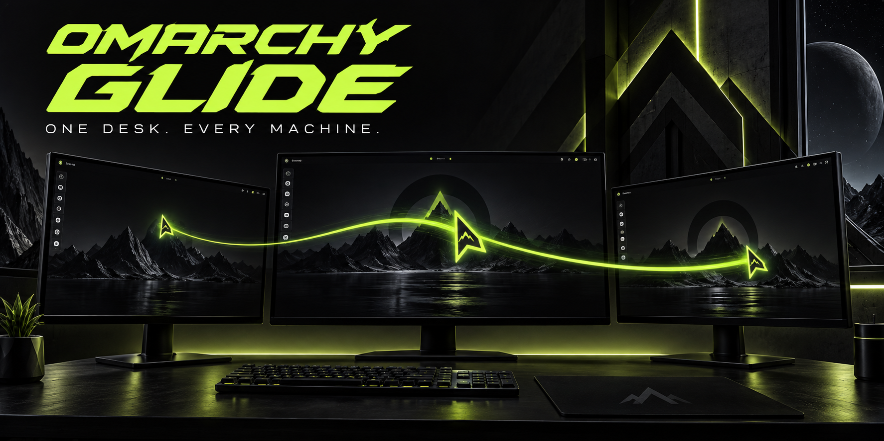

<p align="center">
  
</p>

<p align="center"><strong>Mouse and keyboard sharing for OMARCHY.</strong><br>Move to the edge. Keep working.</p>

<p align="center">
  
  
  
</p>

Glide is an Omarchy plugin. It lets your pointer cross from one Omarchy computer to the next, with your keyboard following along. Arrange your machines in the Omarchy panel, pair them, and work across your desk with one set of controls. Clipboard contents stay local; this is input sharing, not screen streaming or file transfer.

## Your whole desk, connected

| Feature | What it does |
| --- | --- |
| **Cross an edge** | Move between neighboring computers with your mouse. The keyboard follows the active handoff. |
| **Map your desk** | Drag up to nine computers onto a 5 × 3 grid. Arrange neighbors left, right, above, or below. Arrow keys also move the selected machine. |
| **Discover nearby sessions** | Find active Glide desktops on your physical private LAN. Discovery never grants permission to control a machine. |
| **Pair through SSH** | Verify each device's identity through your SSH login before applying a layout. |
| **Apply one layout** | Distribute the arrangement to participating machines, with rollback attempted if deployment fails. |
| **Emergency return** | Press **Left Ctrl + Left Shift + Esc** on the sending keyboard to release capture. |
| **Pause from the bar** | Check live status and pause or resume sharing. Right-click the bar icon for a quick toggle; the action is synchronized to the paired machine over the verified SSH link. |
| **Encrypted connections** | The bundled engine uses DTLS with paired certificate fingerprints in both directions. |
| **Emergency return** | Press **Left Ctrl + Left Shift + Esc** on the sending keyboard to release capture. |

<p align="center"></p>

## Install Glide once

Install Glide on the Omarchy desktop you are using now. After SSH verifies another unlocked Omarchy desktop, Glide transfers its built bundle and installs the plugin and services there automatically. Glide uses Avahi for discovery and UDP port 4242 for input sharing.

```bash
git clone https://github.com/nixfred/Glide.git
cd Glide
./install.sh
```

The installer builds the bundled engine, installs the bar plugin and user services, starts Avahi, and configures LAN-scoped UFW rules. It may ask for `sudo` for packages, device access, Avahi, and firewall setup. With another firewall, configure the LAN rules yourself; the installer currently expects UFW.

Glide uses Lan Mouse's single capture/emulation ownership state machine. It does not run a second evdev ownership watcher, avoiding feedback from injected remote pointer events.

An unrelated existing Lan Mouse configuration is not overwritten. Back it up and move it before installing. Do not run another Lan Mouse daemon alongside Glide: both use the same IPC socket and configuration directory.

## SSH requirements

You install Glide once on the Omarchy desktop you are using. For each additional Omarchy desktop, Glide needs:

- SSH server access on the LAN (`ssh user@machine` must work).
- The remote host-key prompt accepted once, and a password or SSH key that can log in as that user.
- An active Omarchy user session; it does not need to be the focused desktop while pairing.
- Direct private-LAN IPv4 reachability. VPN, public-IP, and IPv6-only paths are not supported.

Glide verifies the SSH host identity interactively, transfers the already-built Glide bundle, asks for the remote user’s sudo password in the SSH terminal, installs the remote dependencies and user services, and starts them. If that account cannot use sudo, Glide stops with a clear error and the remote machine must be installed by an Omarchy administrator first. You do not separately install Glide on every machine. SSH access is only used for installation and layout updates; mouse traffic uses the paired DTLS connection on UDP 4242.

## Set up your desk

1. Open the mouse icon in the Omarchy bar.
2. Select a nearby Omarchy machine and choose **Install & authorize**. The terminal asks for the normal SSH host-key confirmation and login authentication. Verify the host identity before accepting it; Glide installs itself there over that authenticated SSH connection.
3. Choose **Add selected**, then drag the machine to match its physical position.
4. Choose **Apply layout**. Repeat for any additional computers.
5. Cross the corresponding screen edge to start sharing.

Connections follow the nearest machine in the same row or column. Diagonal-only arrangements do not create a connection. On the receiving computer, its own mouse or keyboard reclaims local control.

If you release control while resting on a screen edge, move inward before crossing again. Glide suppresses immediate recapture for 250 ms and rejects entry retries for 500 ms after physical takeover.

## Troubleshooting

**Release a trapped pointer:** press Left Ctrl + Left Shift + Esc on the sending keyboard. To pause sharing from a terminal on either computer:

```bash
systemctl --user stop omarchy-glide.service
```

Resume with `systemctl --user start omarchy-glide.service`. The bar action is the convenient synchronized control: pause on either paired machine and resume on either one.

**Inspect the services:**

```bash
systemctl --user status omarchy-glide omarchy-glide-discovery
journalctl --user -u omarchy-glide -n 80
python3 scripts/glide-control.py status
```

**No nearby machines:** log into an unlocked Omarchy desktop and check Avahi plus LAN mDNS (UDP 5353). VPN, container, loopback, public-IP, and IPv6-only networks are not discovered.

**A pointer is trapped:** press Left Ctrl + Left Shift + Esc to release capture, then move inward before crossing again.

**Network address changed:** rescan and reapply the layout. Saved peer addresses and firewall rules are not a general roaming-network manager.

```bash
./uninstall.sh
```

Uninstall disables the plugin and services and removes recorded Glide firewall rules. It retains pairing identities, source, device-access rules, and recovery files.

## Credits and licensing

Built by **Fred Nix** for Omarchy, powered by **[Lan Mouse](https://github.com/feschber/lan-mouse)** by Ferdinand Schober and contributors. Vendored baseline: `0d2190e787db9e482e17d4c16fb7c00ef4841bcb` (Lan Mouse 0.11.0 source).

The Glide plugin and helpers use the [MIT license](LICENSE). The bundled Lan Mouse engine and its modifications use [GPL-3.0-or-later](engine/LICENSE). Both licenses and upstream attribution are retained.
